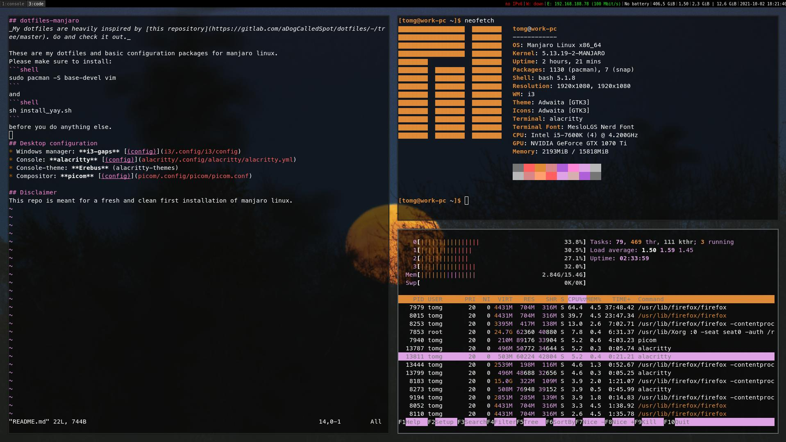

## dotfiles-manjaro
_My dotfiles are heavily inspired by [this repository](https://gitlab.com/aDogCalledSpot/dotfiles/-/tree/master). Go and check it out._

These are my dotfiles and basic configuration packages for manjaro linux.
Please make sure to install: 
```shell
sudo pacman -S base-devel vim
```
and
```shell
sh install_yay.sh
```
before you do anything else.

## Desktop configuration
* Windows manager: **i3-gaps** [(config)](i3/.config/i3/config)
* Console: **alacritty** [(config)](alacritty/.config/alacritty/alacritty.yml)
* Console-theme: **Erebus** (alacritty-themes)
* Compositor: **picom** [(config)](picom/.config/picom/picom.conf)
* Launcher: **Rofi** (**TODO!**)
* Bar: (**TODO!**)


## Disclaimer
This repo is meant for a fresh and clean first installation of manjaro linux.
